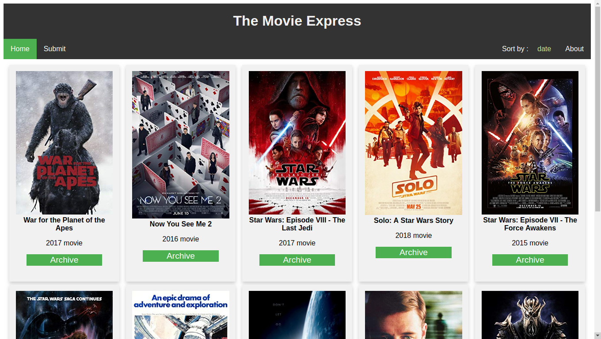
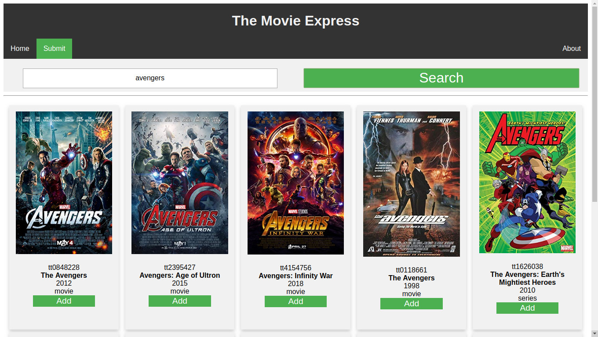
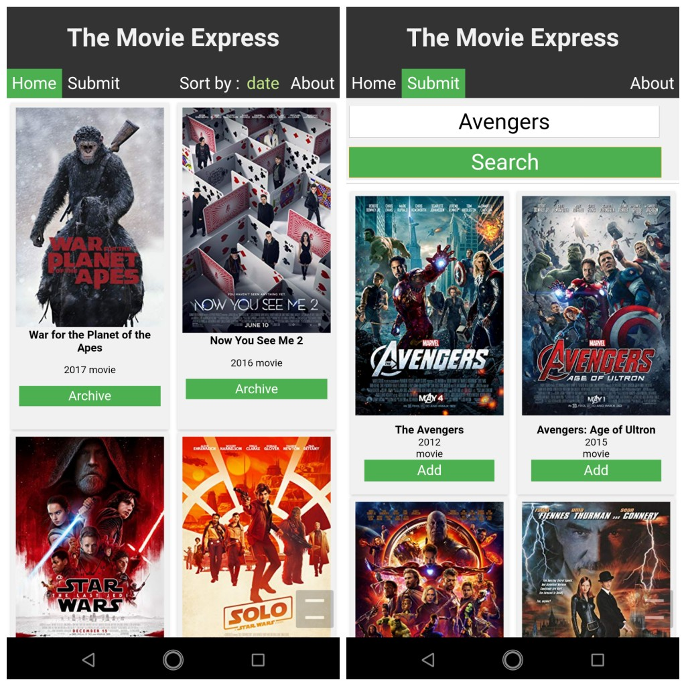
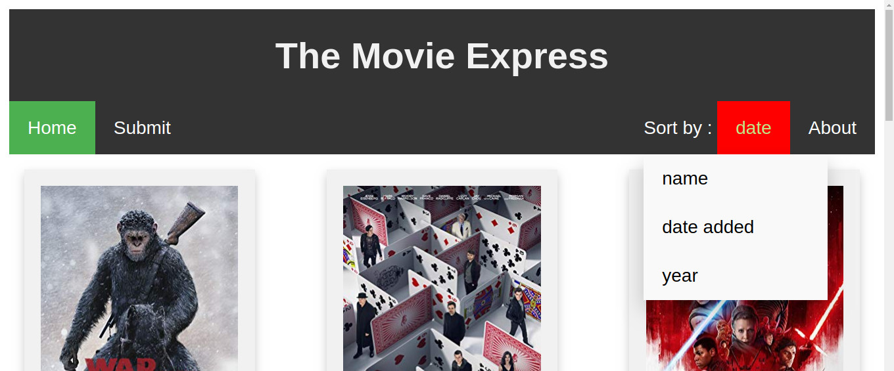
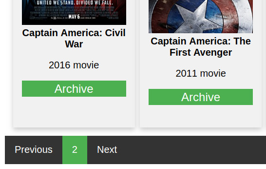

# The Movie Express

A  **Node + Express** web-app to save movie collections (only info)

#### `Node.js - Express.js - PostgreSQL Database - Handlebars Templating - OMDB API`

### Pages:
---

#### Home  `/home`  

Homepage displaying the list of added movies. List shown in descending order of added time by default.




#### Submit  `/submit`

Page used to **search** and **add** new movies to the collection. Search uses external API (`Open Movie Data Base`) to get the desired movie and add it to the collection. 



---

### Mobile View

The web-app viewed on an **android** smartphone/mobile.



---

### Sort Collection

The home page has sort features to sort the collection by **name(ascending)**, **date added(default, descending)**, **year(descending)**. Ascending/Descending function will be added later.



---

### Pages Footer

The movie collections on the home page are organised into multiple pages for minimal view and faster loading times. The footer has buttons for **previous** and **next** page navigation, showing the *current page* as well.



---

### Database Schema

Movies Table:

|id|title|year|type|poster|created|updated|
|--|-----|----|----|------|-------|-------|
|[movie-id]|[movie-title]|[year]|[movie/series/game]|[poster-URL] | [created-time] |[updated-time]|

---

### Back-end API Info : 

- #### `/home` :  GET -- home page.

  - #### `sort=name` :  QUERY -- Sort list by `name` / `date`(default) / `year`.

  - #### `page=2` :  QUERY -- Page number (`integer`).

- #### `/submit` :  GET -- submit page.

- #### `/submit` :  POST -- To search for movie to be added to collection.
  - #### `{ "searchText": <movie-name> }` :  JSON BODY  -- Search for `movie-name`.

    - ####  RESPONSE (JSON) : `movie_list[{ movie-1 }, { movie-2 } ..]`

- #### `/add-movie` :  POST -- To add movie to collection.

  - #### `{ "imdbid": <id>, "title": <titile>, "year": <year>, "type":<type>, "poster": <poster> }` : JSON BODY -- Add specified movie to collection.

    - #### RESPONSE (JSON) : `{"success"}` or `{"failure"}`

- #### `/delete-movie` :  POST -- To archive/delete movie from collection.

  - #### `{ "imdbid": <id> }` : JSON BODY -- Archive/Delete specified movie from collection.

    - #### RESPONSE (JSON) : `{"success"}` or `{"failure"}`

---

### Setup Instructions ( * WIP *) :

1. Get the [OMDB API key](http://www.omdbapi.com/) and save it in a text file `OMDB_API_KEY.txt` in the root path of this repository.

2. Install PostgreSQL : 

   ```bash
   sudo apt-get install postgresql postgresql-contrib
   ```

3. Setup the Database :

   - Log into PostgreSQL prompt:

     ```bash
     sudo -u postgres psql
     ```

     `postgres=#` indicates your are logged in.

   - Make sure to create the USER  with username of your user account and a password:

     ```sql
     CREATE USER <username> WITH PASSWORD '<password>';
     ```

     (note: you can use any name for the user, but to be directly able to login into the database via terminal, it is recommended to give the username of your user account as username for the DB. This is from my experience on Ubuntu 16.04 based system.)

   - Now add the `createdb` permission to the user:

     ```sql
     ALTER USER <username> CREATEDB;
     ```

   - Quit out of SQL prompt:

     ```sql
     \q
     ```

   - Now create **the-movie-express** database under the current user:

     ```bash
     createdb 'the-movie-express'
     ```

4. Change the Database login info:

   ```javascript
   const db = knex({ // postgress database login info
       client: 'pg',
       connection: {
           host: 'localhost',
           user: '<username>',
           password: '<password>',
           database: 'the-movie-express'
       }
   });
   ```

   Make the above changes into files `db-setup/tables-setup.js` and `index.js`

5. Setup the table with the desired schema :

   ```bash
   node db-setup/tables-setup.js
   ```

6. Install all dependencies : 

   ```bash
   npm install
   ```

7. Start the server using :

   ```bash
   npm start
   ```

8.  Fire up chrome or any web browser :

   ```http
   localhost:8080
   ```
