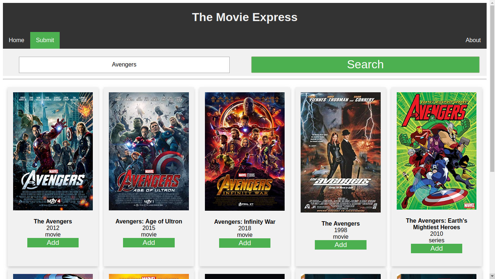
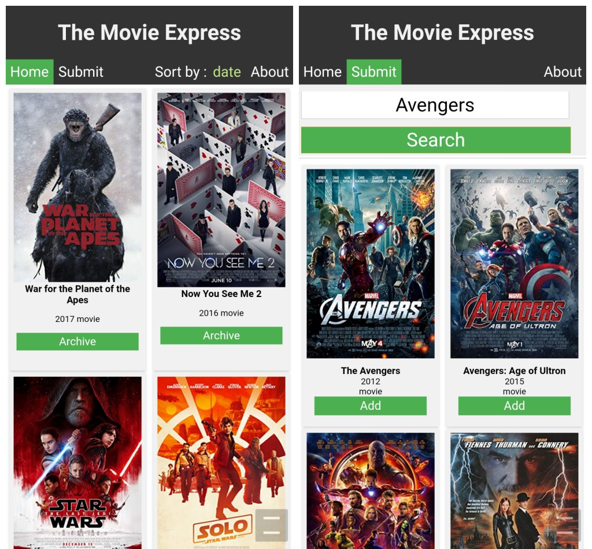

# The Movie Express

A  **Node + Express** web-app to save movie collections (only info)

#### `Node.js - Express.js - PostgreSQL Database - Handlebars Templating - OMDB API`

### Pages:
---

#### Home  `/home`  

Homepage displaying the list of added movies. List shown in descending order of added time by default.


#### Submit  `/submit`

Page used to **search** and **add** new movies to the collection. Search uses external API (`Open Movie Data Base`) to get the desired movie and add it to the collection. 



---

### Mobile View

The web-app viewed on **chrome** running on an **android** smartphone/mobile.



---

### Sort Collection

The home page has sort features to sort the collection by **name(ascending)**, **date added(default, descending)**, **year(descending)**. Ascending/Descending function will be added later.


---

### Pages Footer

The movie collections on the home page are organised into multiple pages for minimal view and faster loading times. The footer has buttons for **previous** and **next** page navigation, showing the *current page* as well.


---

### Database Schema

Movies Table:

|id|title|year|type|poster|created|updated|
|--|-----|----|----|------|-------|-------|
|[movie-id]|[movie-title]|[year]|[movie/series/game]|[poster-URL] | [created-time] |[updated-time]|

---

### Back-end API Info : 

- #### `/home` :  GET -- home page.

  - #### `sort=name` :  QUERY -- Sort list by `name` / `date`(default) / `year`.

  - #### `page=2` :  QUERY -- Page number (`integer`).

- #### `/submit` :  GET -- submit page.

- #### `/submit` :  POST -- To search for movie to be added to collection.
  - #### `{ "searchText": <movie-name> }` :  JSON BODY  -- Search for `movie-name`.

    - ####  RESPONSE (JSON) : `movie_list[{ movie-1 }, { movie-2 } ..]`

- #### `/add-movie` :  POST -- To add movie to collection.

  - #### `{ "imdbid": <id>, "title": <titile>, "year": <year>, "type":<type>, "poster": <poster> }` : JSON BODY -- Add specified movie to collection.

    - #### RESPONSE (JSON) : `{"success"}` or `{"failure"}`

- #### `/delete-movie` :  POST -- To archive/delete movie from collection.

  - #### `{ "imdbid": <id> }` : JSON BODY -- Archive/Delete specified movie from collection.

    - #### RESPONSE (JSON) : `{"success"}` or `{"failure"}`

---

### Setup Instructions ( * WIP *) :

1. Make sure PostgreSQL is installed.

2. Setup the table with the desired schema :

   ```bash
   node db-setup/tables-setup.js
   ```

3. Install all dependencies : 

   ```bash
   npm install
   ```

4. Start the server using :

   ```bash
   npm start
   ```

5.  Fire up chrome or any web browser :

   ```http
   localhost:8080
   ```

   

